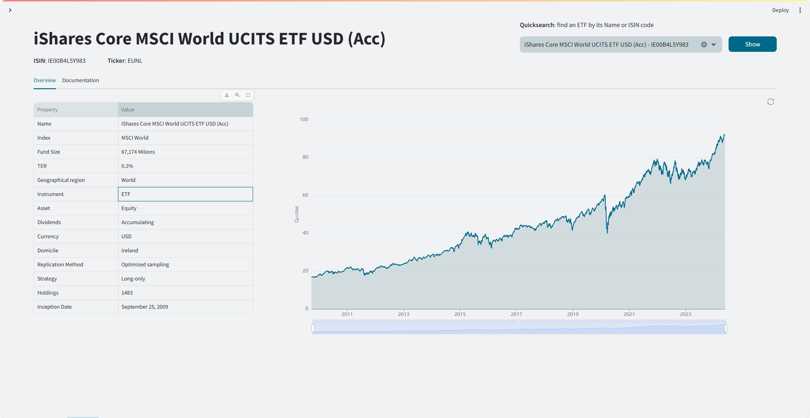
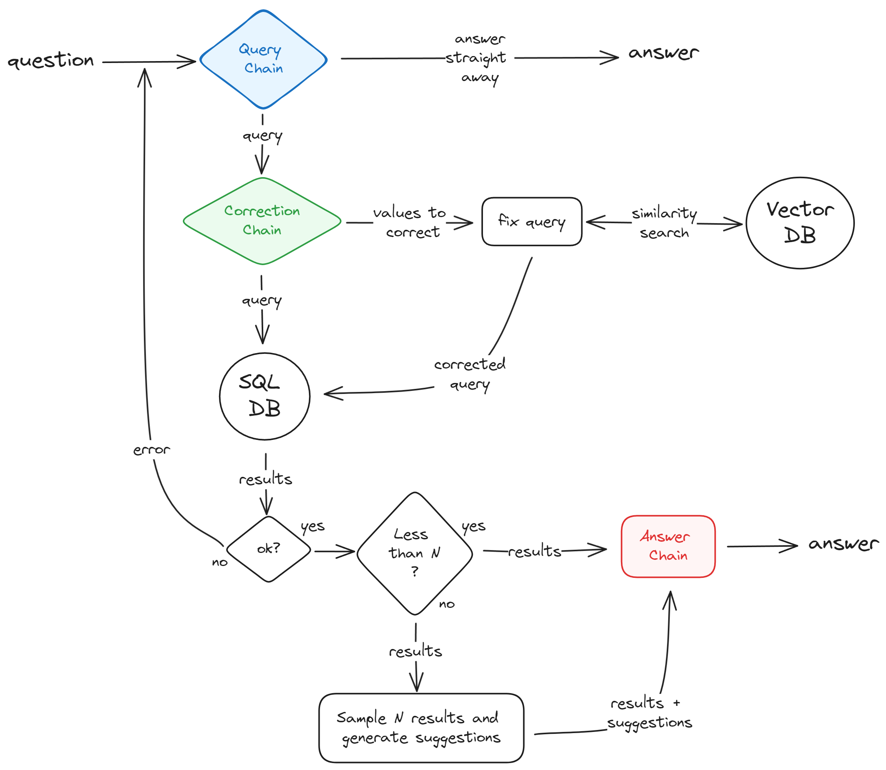
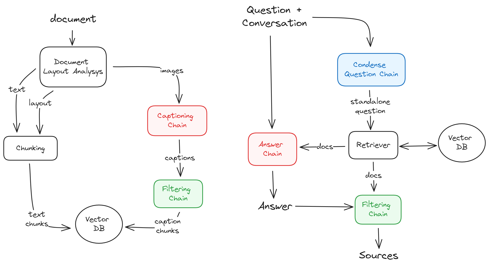

# ETF Assistant
This project is a tech demo exploring how some of the most popular GenAI techniques can enhance an ETF web app.



## Overview
ETFs (exchange-traded funds) have gained significant popularity over the past two decades. According to Investopedia:
> "An exchange-traded fund (ETF) is a pooled investment security that can be bought and sold like an individual stock. ETFs can be structured to track anything from the price of a commodity to a large and diverse collection of securities."

Numerous online platforms simplify navigating the vast array of ETFs, offering detailed information about each one. *ETF Assistant* is a proof-of-concept showcasing how recent GenAI techniques can make these platforms more intuitive, flexible, and powerful. This project focuses on two primary functionalities typically provided by these platforms: ETF screening and analytics.

### ETF Screening

Popular ETF websites usually feature a page allowing users to navigate the entire list of existing ETFs, with a plethora of filters to narrow down the view based on specific criteria.

In this project, I implemented a similar page (*ETF Screener*), replacing the filters with a chatbot interface. Users can directly describe in natural language the types of ETFs they are looking for, and the AI will convert the request into a database query and present the results. This approach offers a more intuitive interface and more flexible search options, not being limited to preset filters.

<video controls src="resources/smart-screener.mp4" title="Smart Screener"></video>

At its core, this feature uses an LLM to convert natural language questions into SQL queries. However, many additional techniques are employed to ensure the chatbot is robust.


### ETF Analytics
ETF websites have a page presenting information on individual ETFs, typically including an overview of the fund's main characteristics, statistics on past performance, and official documents from the issuer.

This project includes an *ETF analytics* page for each fund, showing its overview, past performance, and official documentation. The various documents released by issuers tend to be technical and lengthy, making detailed information less accessible to users. To address this, *ETF Assistant* features a chatbot that can directly answer detailed questions, saving users from having to read through extensive documentation.

<video controls src="resources/docs-qa.mp4" title="Documents Q&A"></video>

This feature is implemented as a RAG (Retrieval-Augmented Generation) chatbot, connecting the LLM with the relevant body of knowledge.

## Setup

#### Enviornment
Setup the python environment:
1. Install poetry [https://python-poetry.org/docs/#installation]
1. Create a virtual environment
3. Install dependencies with `poetry install`

#### Blob storage
I used a local MinIO service as the blob storage for the project. You can replicate it as follows:
1. Download and install it:
    ```
    wget https://dl.min.io/server/minio/release/linux-amd64/archive/minio_20240310025348.0.0_amd64.deb -O minio.deb
    sudo dpkg -i minio.deb
    ```
2. It will create a systemd service file located at `/usr/lib/systemd/system/minio.service` which requires to setup permissions:
    ```
    groupadd -r minio-user
    useradd -M -r -g minio-user minio-user
    chown minio-user:minio-user /mnt/data
    ```
3. Create a configuration file at `/etc/default/minio` like [this](https://min.io/docs/minio/linux/operations/install-deploy-manage/deploy-minio-single-node-single-drive.html#create-the-environment-variable-file) and define user/password 

4. Start the service with `sudo systemctl start minio.service`. The consolo will be available at `http://localhost:9001`

5. [Optional] enable the service to automatically start on reboot with `sudo systemctl enable minio.service`

#### Config file
Create a `.env` file with all configurations; a `sample_env` is provided as reference which only requires to add your private keys for OpenAI and Langfuse and user/password for MinIO. 

#### Sample data
A `sample_data.zip` file is provided with a few sample data that are enough to test the main functionalities. 

Unzip it and move the `sqlite/etf.sqlite3` and `splitters_cache` folders into a `data` folder located at the root of the roject.

- The `sqlite` containes a pre-created db with the list of etfs
- The `Documents` contains a few example documents 
- The splitters cache contains a cached chunking for the `swda_factsheet.pdf` document which includes precomputed captions for the images. When adding that specific file with `include images` enabled it will use the cached captions and avoid recomputing them (which is expensive with gpt-4). 


#### Start the server
`python -m streamlit run app/web/Home.py`

## Implementation details

### ETF Screener
The *ETF Screener* page displays a list of all available ETFs alongside a chat interface with a virtual assistant. This assistant can filter the ETFs based on the user's requests and refine the selection with subsequent questions. The selected ETFs for each user input are displayed in a separate tab.

The diagram below describes the process by which the chatbot generates answers to user questions. Highlighted blocks indicate key steps involving a request to an LLM (similarity search also uses an LLM). The process is implemented using LangChain and leverages GPT-3.5-turbo as the LLM, though any similarly performing LLM that supports function calls can be used.



Chatbots designed to answer user questions that require fetching data from a database are often implemented as agents. These agents operate as cyclic processes where the Language Model (LLM) repeatedly generates arguments to call predefined functions, collects results, and continues until it believes it has enough information to provide a final answer. Typically, these functions include:
- One for retrieving the schema of tables needed to answer the question.
- One for executing the generated query.

From personal experience, I've found that these chatbots benefit significantly from being implemented as simple Directed Acyclic Graph (DAG) processes. In this approach, the chatbot deterministically chooses which tables to use first and then generates the query. This method eliminates the need for the LLM to decide the order of function calls, simplifying the code and increasing reliability. 

#### Query generation
The core component is the **Query Chain**, where a request is made to an LLM that is prompted to either:
- Generate the SQL query to extract from the database the information required to answer the user
- Directly respond to the user if its question does not involve quierying the database (i.e. 'thank you!')

This is achieved by provided the LLM with two tools/functions, one for executing the query and one for answering the user, and forcing it to always use one of the two. The functions are never actually called, but are only used to instruct the model on the format to use for answering. This solution proved to be the most effective way to handle both modalities. Other solutions, like requesting JSON-formatted output, were underwhelming in one of the two modes. Since there is only one table to query, its schema and a description of each relevant column are directly included in the prompt. Describing the columns is crucial for generating good queries.

Simple prompt engineering is a great starting point for getting LLMs to generate good answers. However, the chatbot significantly benefits from both pre-processing generated queries before execution and post-processing their results before creating the final answer.

#### Correcting the Queries (Work in progress)
When the user question requires generating a query that filters on specific values of one or more columns, the LLM often struggles to create a correct query. For example, if the user asks to "return all distributing ETFs," the LLM should generate the following query:

```
SELECT * FROM etf_table
WHERE etf_table.dividends = 'distributing'
```
In this case, the dividends column is categorical with values that can assume only one of N possible values. Unless the LLM is informed in the prompt about all possible categories, it has no way of knowing how to construct this filter (should it use 'Distribute', 'distributing', or 'distr'?).

> work in progress


#### Post-Processing Query Results
Queries returning a relatively high number of rows from the database are problematic because it's challenging for the LLM to generate a response from all this data, even if it fits in the prompt. To address this, I adopted the following approach:

The results of the query execution are always shown on screen in a separate table, allowing the user to inspect and possibly download it.
The chain that generates the final answer can work in one of two modes depending on the size of the query result:
- If fewer than N ETFs are returned by the query, all are passed to the model which is prompted to present them to the user.
- If more than N are returned, the LLM is prompted to only report the number of ETFs found and invite the user to consult the full table shown on screen. 
For the second mode, a set of columns with high variability among the returned ETFs are extracted and sent to the LLM, prompting it to suggest these to the user as possible criteria for narrowing down the search.

### Documents Q&A
The *ETF Analytics* page provides an overview of each fund's main characteristics and a graph of its historical values. In the Documentation tab, users can find detailed documents from the fund issuer describing the fund's characteristics.

Users can open a chat with each document to ask questions about its content. The chatbot uses Retrieval-Augmented Generation (RAG) to access and provide information from the document.

The diagram below illustrates how the document is pre-processed and added to the vector database (left) and how the chatbot accesses it to retrieve relevant information and use it to answer the user's question (right).



#### Chunking the Documents
The document is first processed through a Layout Analysis module that extracts text, tables, and images from the document, and optionally, information on the text layout (e.g., title, header, paragraph).

I experimented with two approaches for extracting document elements:
- Using `unstructured.io`, a library employing OCR and object detection modules to extract text, tables, and images, and split the text according to its layout.
- Simply splitting the text by pages.

The first method, although promising, proved unreliable and was outperformed by the simple approach of creating a chunk of text for each page. It struggled with multi-column documents and failed to recognize document layout accurately, resulting in incongruent text chunks. Therefore, textual chunks are generated by dividing the text by pages; unstructured.io was only used to extract images from the document. 

Images are converted into textual chunks as follows: each extracted image is passed to GPT-4 to generate captions. Each caption is reviewed by an LLM, which discards any caption without useful information (e.g., logos). The remaining captions are added to the vector store as textual chunks. This multimodal approach allows the chatbot to handle questions that can only be answered by looking at images, such as information reported in a graph.

#### Retrieval-Augmented Generation
When the chatbot receives a question, it first passes it to an LLM that is prompted to rewrite it as a stand-alone question, ensuring it can be comprehended without additional context. This step is necessary because users may ask follow-up questions that implicitly refer to previous messages. By making it stand-alone, the chatbot can better retrieve relevant chunks from the vector database via similarity search using a more meaningful query vector.

The retrieved chunks are then passed in a prompt, along with the original question and past messages, to generate the final answer.

Since not all retrieved documents may be useful, each chunk is also passed, along with the final answer, to an LLM that determines whether the chunk was useful for composing the answer. This process enables returning a list of document passages or images that were actually used as sources for answering the question, allowing the user to double-check the answer's correctness.
